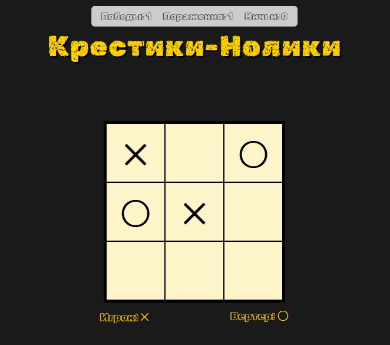
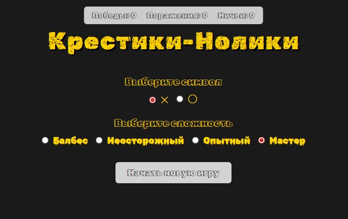
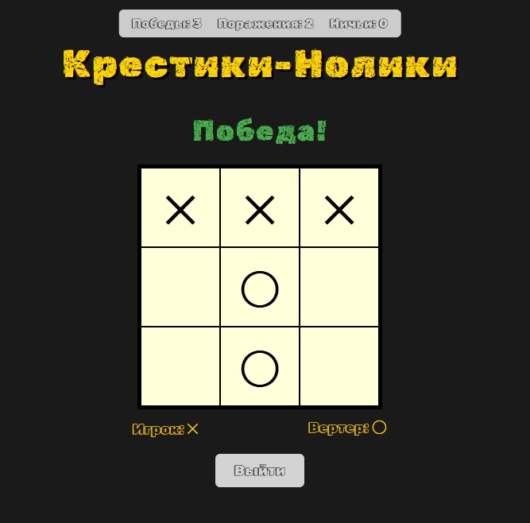

# TicTacToe

Игра «Крестики-Нолики» с компьютером. Сервер на ASP.NET Core Web API, клиент на Blazor WebAssembly. Проект создан в учебных целях в рамках обучения в Школе 21.



## Быстрый старт

```bash
git clone https://github.com/von-neyman/tictactoe-aspnet.git
cd tictactoe-aspnet
```

### Visual Studio

1. Открыть `TicTacToe.sln`
2. Настроить несколько запускаемых проектов: `TicTacToe.Server` и `TicTacToe.Client` (правой кнопкой по решению → Настроить запускаемые проекты → Несколько запускаемых проектов → Запуск для обоих)
3. Запустить (F5)

## Visual Studio Code / терминал

Запустить сервер и клиент в разных терминалах:

```bash
dotnet run --project TicTacToe.Server
dotnet run --project TicTacToe.Client
```

При запуске в консоли выводятся порты, например:

```
Now listening on: http://localhost:5114   ← сервер
Now listening on: http://localhost:5122   ← клиент
```

Эти порты могут отличаться при каждом запуске. Нужно указать их в настройках:

В TicTacToe.Client/wwwroot/appsettings.json указать адрес сервера (тот, что вывелся в консоли сервера):

```json
{
    "ServerUrl": "http://localhost:5114"
}
```

В TicTacToe.Server/appsettings.Development.json указать адрес клиента в CorsOrigins (тот, что вывелся в консоли клиента):

```json
{
    "Logging": {
        "LogLevel": {
            "Default": "Information",
            "Microsoft.AspNetCore": "Warning"
        }
    },
    "CorsOrigins": "http://localhost:5122"
}
```

Перезапустить оба проекта. Открыть в браузере адрес клиента (например, http://localhost:5122).

При запуске через Visual Studio порты фиксированные (7175 и 7160) и уже прописаны в appsettings.json и launchSettings.json. При запуске через терминал порты назначаются динамически — их нужно обновлять в настройках вручную.

## Требования

| Компонент | Примечание |
|-----------|------------|
| .NET SDK | Версия 8.0 или выше |
| Браузер | Любой современный (Chrome, Firefox, Edge) |



## Как играть

- Выбрать символ (крестики или нолики) и сложность
- Если выбраны нолики — компьютер ходит первым
- Кликать по пустой клетке, чтобы сделать ход
- Компьютер отвечает автоматически
- Игра заканчивается победой, поражением или ничьей
- Счётчик вверху считает результаты за сессию

## Сложность

| Уровень | Значение | Описание |
|---------|----------|----------|
| Балбес | 0 | Случайные ходы |
| Неосторожный | 1 | Видит только свои ближайшие ходы |
| Опытный | 2 | Видит свои ближайшие ходы и ближайший ход игрока |
| Мастер | 9 | Идеальная игра, просчитывает всё |

## Алгоритм компьютера

Компьютер использует алгоритм Минимакс с настраиваемой глубиной просчёта (параметр `Difficulty`). На каждом ходе перебираются все возможные варианты, для каждого строится дерево игры до заданной глубины, позиции оцениваются: +1 (победа компьютера), -1 (победа игрока), 0 (ничья). Если несколько ходов одинаково хороши — выбирается случайный, чтобы игра не была предсказуемой.



## Архитектура проекта

Многослойная архитектура: Domain, Datasource, Web, DI.

| Слой | Назначение |
|------|------------|
| Domain | Бизнес-логика: модели Game и GameField, интерфейс IGameService |
| Datasource | Хранение игр в памяти (ConcurrentDictionary), репозиторий, мапперы, реализация GameService с Минимаксом |
| Web | REST API контроллер, DTO для обмена с клиентом, мапперы |
| DI | Конфигурация зависимостей (GameStorage как singleton и т.д.) |

Клиент — отдельный проект `TicTacToe.Client` на Blazor WebAssembly. Общается с сервером через HTTP, дублирует DTO-модели (ограничение ТЗ).

## Технологии

- C#, .NET 8
- ASP.NET Core Web API
- Blazor WebAssembly
- Алгоритм Минимакс
- ConcurrentDictionary
- Dependency Injection
- CORS
- Swagger